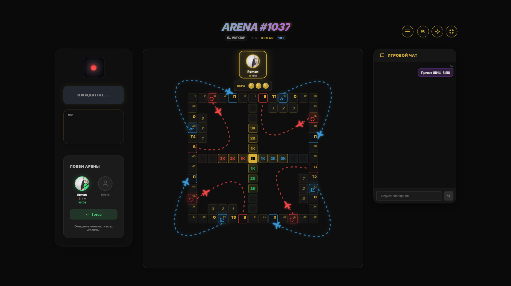

# 🎲 Shish-Bish — Premium Multiplayer Board Game



<div align="center">

[](https://nextjs.org/)
[](https://reactjs.org/)
[](https://socket.io/)
[](https://www.prisma.io/)
[](https://www.postgresql.org/)
[](https://www.docker.com/)

---

**Shish-Bish** — это многопользовательская настольная игра в реальном времени, вдохновленная классическими правилами и облаченная в современный "Glassmorphism" дизайн. Проект сочетает в себе высокую производительность Next.js 15 и мгновенный отклик благодаря Socket.io.

[Возможности](#✨-возможности) • [Установка](#🚀-быстрый-старт) • [Стек](#🛠-технологический-стек) • [Docker](#🐳-запуск-через-docker)

</div>

---

## ✨ Возможности

- 🎮 **Real-time Multiplayer**: Мгновенная синхронизация игрового процесса между игроками через **Socket.io**.
- 🎲 **3D Dice Engine**: Реалистичные 3D кости с физикой и плавными анимациями броска.
- 💎 **Premium Glass Design**: Элегантный интерфейс с эффектами матового стекла, золотыми акцентами и динамическим освещением.
- 🏠 **Система Комнат**: Создание игровых арен, лобби ожидания и управление списком активных комнат.
- 💬 **Внутриигровой Чат**: Общайтесь с соперниками прямо во время партии.
- 👤 **Профили и Кастомизация**: Персонализация игрока, отслеживание статистики и смена настроек.
- 🌍 **Internationalization (i18n)**: Полная поддержка нескольких языков (Русский/English) и переключение тем оформления.
- 🐳 **Full Stack Docker**: Готовая инфраструктура для быстрого развертывания всего стека (App + DB + Socket Server).

---

## 🛠 Технологический стек

### Frontend & Core
- **Framework**: [Next.js 15 (App Router)](https://nextjs.org/)
- **Library**: [React 19](https://react.dev/)
- **Styling**: Vanilla CSS (Premium Glass Design System)
- **Icons**: [Lucide React](https://lucide.dev/)
- **Real-time**: [Socket.io-client](https://socket.io/)

### Backend & Infrastructure
- **Server**: Node.js & Socket.io Server
- **ORM**: [Prisma](https://www.prisma.io/)
- **Database**: PostgreSQL
- **Auth**: [NextAuth.js](https://next-auth.js.org/)
- **Validation**: Zod (implied)
- **Security**: bcryptjs

---

## 🚀 Быстрый старт

### 1. Клонирование и установка
```bash
git clone https://github.com/your-username/shish-bish.git
cd shish-bish
npm install
```

### 2. Настройка окружения
Создайте файл `.env` на основе примера:
```bash
cp .env.example .env
```
Укажите параметры подключения к БД (`DATABASE_URL`), секреты для Auth и URL сокет-сервера.

### 3. Инициализация базы данных
```bash
# Генерация Prisma Client
npx prisma generate

# Применение схемы к БД
npx prisma db push

# (Опционально) Заполнение тестовыми данными
npm run db:seed
```

### 4. Запуск в режиме разработки
```bash
npm run dev
```
Откройте [http://localhost:3000](http://localhost:3000).

---

## 🐳 Запуск через Docker

Самый простой способ запустить весь проект с базой данных:

```bash
# Сборка и запуск контейнеров
docker-compose up -d --build
```

**Доступные сервисы:**
- **Web App**: `http://localhost:3000`
- **Socket Server**: `:3001` (или настроенный порт)
- **PostgreSQL**: `:5432`
- **Prisma Studio**: `npx prisma studio`

---

## 📂 Структура проекта

```text
shish-bish/
├── prisma/             # Схемы БД и сиды
├── public/             # Статические ассеты (иконки, баннеры)
├── src/
│   ├── app/            # Next.js App Router (UI & Logic)
│   ├── components/     # React компоненты (Board, Dice, Chat)
│   ├── context/        # Управление глобальным состоянием
│   ├── lib/            # Утилиты и конфигурации (Prisma, Socket)
│   ├── server/         # Логика Socket.io сервера
│   └── types/          # TypeScript определения
├── Dockerfile          # Сборка веб-приложения
├── Dockerfile.socket   # Сборка сокет-сервера
└── docker-compose.yml  # Оркестрация всей инфраструктуры
```

---

## 📄 Лицензия

Этот проект распространяется под лицензией MIT.

---
<div align="center">
⭐ Если вам понравилась игра, будем благодарны за звезду на GitHub!
</div>
